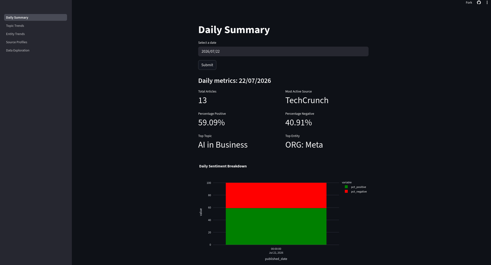
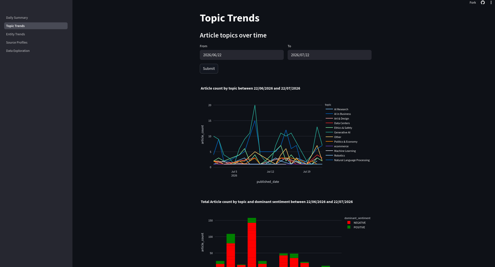
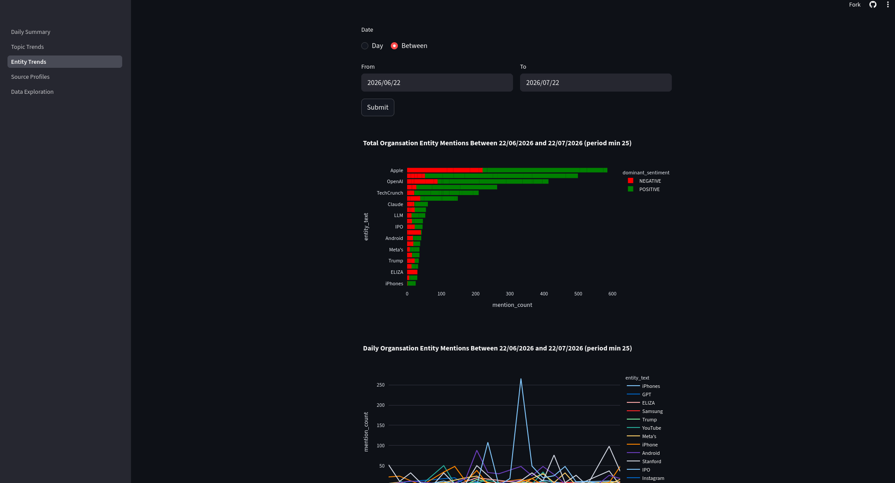

# AI News Intelligence

Data engineering pipeline that scrapes AI related news articles from multiple sources, enriches with NLP and analyses for insights.

**Live dashboard:** [https://ainewsintelligence-qsfysdaxgs5c5mdj7ob9mt.streamlit.app/](https://ainewsintelligence-qsfysdaxgs5c5mdj7ob9mt.streamlit.app/)

YouTube Walkthrough: [https://youtu.be/AZn8Bab-Tvg](https://youtu.be/AZn8Bab-Tvg)

## Architecture

The pipeline follows an extended medallion architecture, orchestrated by Airflow and transformed with dbt on Databricks.

Bronze, Silver and Gold live in Databricks as delta tables. The bronze layer has tables for the raw feed and content, silver layer has the cleaned data and NLP enriched (sentiment analysis, topics & entity extraction). There is an intermediate layer to explode topics and entities to prepare for gold which is the aggregated trends for topics, entities, source profiles and a daily summary.

NLP enrichment is written directly in python using the Databricks SQL connector, since model inference can't be handled in SQL. All other transformations are handled id dbt.

## Tech Stach

- **Orchestration:** Airflow
- **Scraping:** Python
- **NLP:** Spacy, HuggingFace
- **Storage:** AWS s3
- **Warehouse:** Databricks
- **Transformation:** dbt
- **Dashboard:** Streamlit

## Airflow Dags

The pipeline is split into two daily dags, one for ingestion, and one for NLP and data transformation.

**ingestion_dag**: Scrapes the latest rss feed data from each source every day, then uploads this to an s3 bucket as a parquet file. The urls are then fetched, and used to scrape the article content, which is also uploaded as a parquet.

**nlp_dag**: The first task is a sensor to check if a new parquet has been uploaded to the s3 bucket today, if not, the dag fails. If successful, the dag spins up a dbt container and runs all of the transformations and tests. NLP is also performed directly in python using the Databricks SQL connector.
